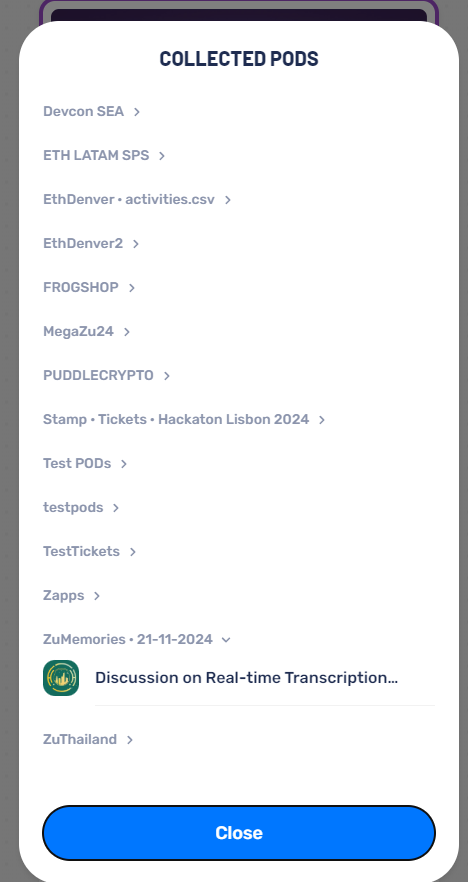
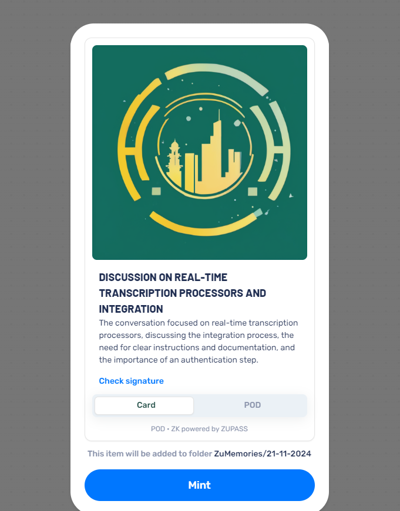
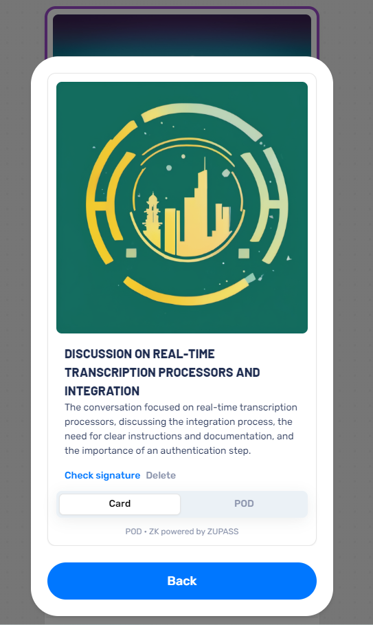

# ZuMemories - Verifiable Conversation Memories with Zupass

ZuMemories is a bridge between Omi's AI-powered conversations and Zupass's verifiable credentials system. It allows you to create cryptographically verifiable proofs of your conversations using PODs (Provable Object Datatypes).

## How it Works

1. When Omi processes your conversations (through memory triggers or memory prompts), it sends a webhook to ZuMemories
2. ZuMemories creates a POD containing:
   - Conversation title
   - Overview/summary
   - Timestamp
   - Your Zupass ownership ID
   
3. You receive a mint link to add this memory to your Zupass
4. The POD is stored in your Zupass wallet under the `ZuMemories` folder, organized by date (e.g., `ZuMemories/21-11-2024`)

## Use Cases

### Social Interaction
- Share verifiable memories with friends
- Mint shared memories from group conversations
- Create a cryptographic timeline of important discussions

### Intellectual Property Protection
- Prove the existence and timing of specific conversations
- Establish verifiable timestamps for ideas and discussions
- Create zero-knowledge proofs of conversation contents without revealing sensitive details

### Professional Documentation
- Document important meetings with verifiable timestamps
- Create proof of discussions without compromising privacy
- Maintain a verifiable record of professional interactions

## Development

### Installation
To install dependencies:
```bash
bun install
```

### Running the Server
To start the development server run:
```bash
bun run dev
```

The server will start on http://localhost:4000/

### API Endpoints

#### Create POD
`POST /create-pod`

Request body (JSON):
```json
{
  "id": string,
  "created_at": string,
  "structured": {
    "title": string,
    "overview": string,
    "emoji": string,
    "category": string,
    "actionItems": any[],
    "events": any[]
  },
  "started_at": string,
  "finished_at": string,
  "transcript_segments": [
    {
      "text": string,
      "speaker": string,
      "speaker_id": number,
      "is_user": boolean,
      "start": number,
      "end": number
    }
  ],
  "plugins_results": any[],
  "geolocation": null | object,
  "photos": any[],
  "discarded": boolean,
  "deleted": boolean,
  "source": string,
  "language": string,
  "external_data": null | object,
  "status": string
}
```

## Technical Stack
- Built with Elysia and Bun runtime
- Integrates with [Omi's Memory System](https://docs.omi.me/docs/developer/apps/Introduction)
- Uses [POD (Provable Object Datatype)](https://pod.org/pod/introduction) for cryptographic verification
- Interfaces with Zupass for credential storage and verification


## Screenshots

### PODs Collection in Zupass

*Your ZuMemories are organized by date in your Zupass*

### Minting a Memory POD

*The minting interface showing conversation details and folder organization*

### Viewing a Memory POD

*Detailed view of a minted memory with verification options*
